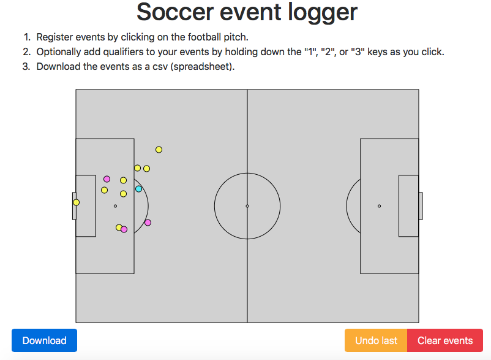

# elm-soccer-tracker
Track events on a football pitch in Elm (v0.18).

[](https://torvaney.github.io/projects/tracker)

Try it out [here](https://torvaney.github.io/projects/tracker).

## Compile

Compile to javascript with `elm-make`
```
elm-make src/elm/Main.elm --output src/static/js/main.js
```
